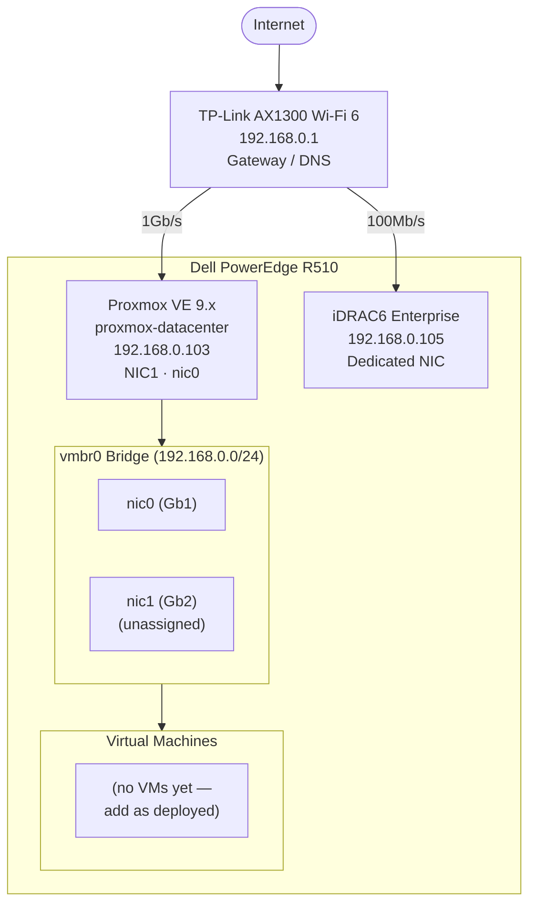
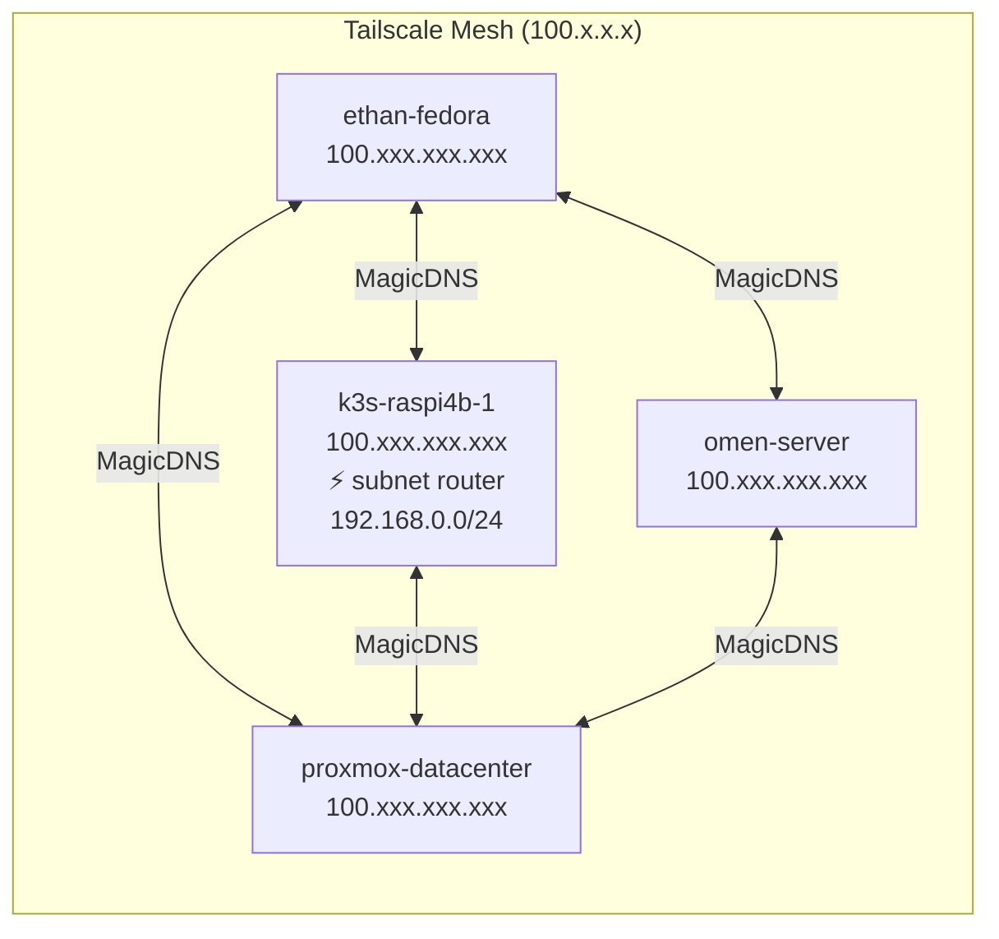
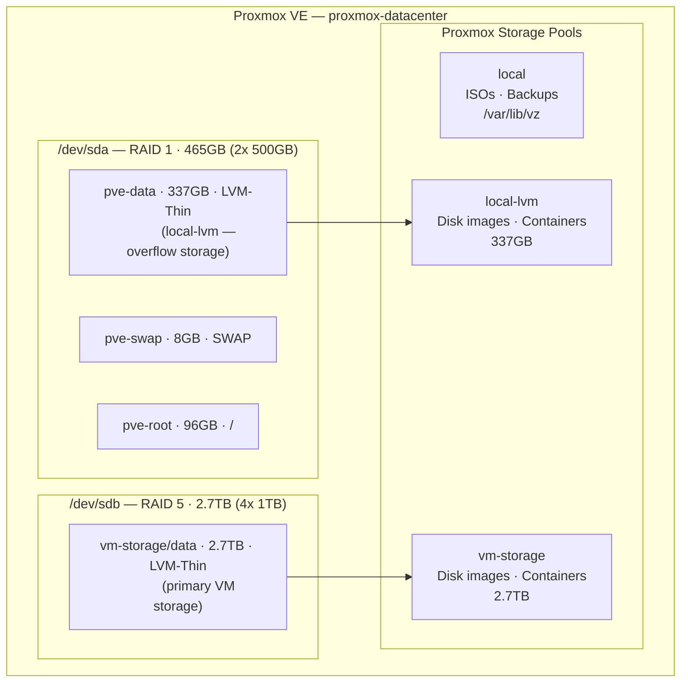

# Network Topology PUBLIC FACING

**Last updated:** June 2026  
**Subnet:** 192.168.0.0/24  
**Gateway:** 192.168.0.1

---

> **Note:** This is a demo file with all sensitive information scrubbed from it.

## Physical Network



---

## Tailscale Overlay Network



> **Note:** Subnet routing (`192.168.0.0/24`) is advertised by `k3s-raspi4b-1` as an always-on subnet router. This means local network access is maintained even when Proxmox is rebooting. See [ADR-002](../decisions/ADR-002-subnet-routing-move-to-raspi.md).

---

## Storage Network (Internal)



---

## VM Network Layout (Planned)

As VMs are deployed they will occupy static IPs in the `192.168.0.0/24` subnet. Reserved ranges:

| Range | Purpose |
|-------|---------|
| `192.168.0.1` | Router (gateway) |
| `192.168.0.100–109` | Physical infrastructure (Proxmox, iDRAC) |
| `192.168.0.110–139` | k3s nodes |
| `192.168.0.140–169` | Microservice VMs |
| `192.168.0.170–189` | Database VMs |
| `192.168.0.190–199` | Dev station VMs |
| `192.168.0.200–219` | Infrastructure services (Pi-hole, NetBox, Nginx PM) |
| `192.168.0.220–254` | DHCP / unmanaged devices |

> Full IP assignments are maintained privately. See [ip-allocation.md](ip-allocation.md) for the public template.

---

## Interface Reference

### Proxmox Host (`proxmox-datacenter`)

| Interface | MAC | IP | Speed | Role |
|-----------|-----|----|-------|------|
| `nic0` (Gb1) | `xx:xx:xx:xx:xx:x1` | — | 1Gb/s | Bridge port for vmbr0 |
| `nic1` (Gb2) | `xx:xx:xx:xx:xx:x2` | — | 1Gb/s | Unassigned |
| `vmbr0` | — | `192.168.0.103/24` | 1Gb/s | Linux bridge — all VM traffic |
| iDRAC (dedicated) | `xx:xx:xx:xx:xx:x3` | `192.168.0.105` | 100Mb/s | Out-of-band management |

### Additional NICs (not yet installed)

| NIC | Speed | Status |
|-----|-------|--------|
| Intel 10GbE | 10Gb/s | Available — not installed |
| Chelsio 10GbE | 10Gb/s | Available — not installed |

> When 10GbE NICs are installed, a second bridge (`vmbr1`) will be created for a dedicated high-throughput network segment.

### `/etc/network/interfaces`

```
auto lo
iface lo inet loopback

iface nic0 inet manual

auto vmbr0
iface vmbr0 inet static
        address 192.168.0.103/24
        gateway 192.168.0.1
        bridge-ports nic0
        bridge-stp off
        bridge-fd 0

iface nic1 inet manual

source /etc/network/interfaces.d/*
```

---

## Access Methods

| Method | Address | Requires |
|--------|---------|----------|
| Proxmox Web UI | `https://192.168.0.103:8006` | Local network |
| Proxmox Web UI | `https://proxmox-datacenter:8006` | Tailscale MagicDNS |
| SSH | `ssh proxmox` | Local network + `~/.ssh/config` alias |
| SSH | `ssh root@proxmox-datacenter` | Tailscale MagicDNS |
| iDRAC Web | `https://192.168.0.105` | Local network |
| iDRAC SSH | `ssh root@192.168.0.105` | Local network |

---

## Known Network Issues

| Issue | Workaround |
|-------|------------|
| None | — |

---

> **Security note:** MAC addresses and Tailscale IPs in this document have been redacted. Real values are maintained privately.

*See also: [ip-allocation.md](ip-allocation.md) · [Hardware & Setup](../hardware/proxmox-setup.md) · [ADR-002 — Subnet Routing](../decisions/ADR-002-subnet-routing-move-to-raspi.md)*
